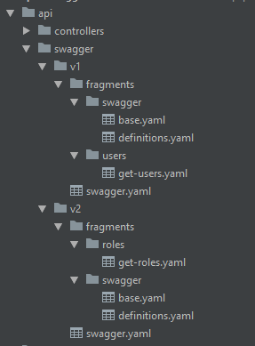

# Split Swagger
This script allows you to split the `swagger.yaml` file in fragments for easy maintenance. If you have a similar configuration to this [repository](https://github.com/moisesicaza/swagger-express-api-versioning), this script can be of great helpful.

# How to use?
(1) First, copy the `split-swagger` directory and its contents to the project root.

(2) Make sure that the `PATH` variable in the `split-swagger/split.js` file matches the path of the swagger folder in your project.

```javascript
let PATH = './api/swagger';
```

(3) Your swagger directory structure should look like the image below. In the fragments folder of this repository there are examples of how to structure files and subfolders.



(4) Make sure you have the following dependencies in your package.json file.

* extendify
* node-watch
* nodemon

(5) Add the following commands to your package.json

```javascript
"scripts": {
    ...
    "start:dev": "node ./node_modules/nodemon/bin/nodemon.js -e yaml --exec \"npm run start || exit 1\"",
    "split:swagger": "node ./split-swagger/split.js"
  }
```

(6) Start the app server executing `npm run start:dev` on one terminal and in another terminal run the `npm run split:swagger v1` or `npm run split:swagger v2` command depending on which API versioning files you want to edit.

The script will automatically detect changes to the `fragments` folder and will be update the swagger.yaml file for each change.